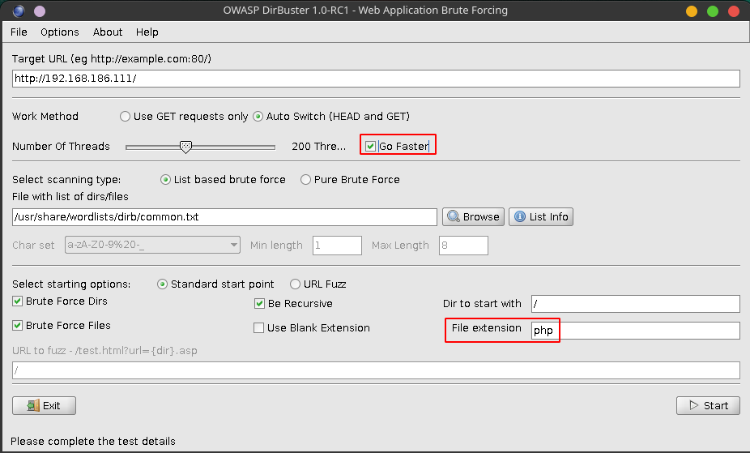

# FunboxEasy
Points - 5  
Difficulty - Easy
---

First we scan the given ip using
```
$ nmap -A ip_address
```


There's an SSH port open and a website hosted, not pretty interesting.      
Let's try to use directory buster on the website.



Select the Go faster checkbox to save a little time, and for file extensions enter php in hope that we can find a login page of some kind.

From the results we can see that there's a store folder with an admin.php.     
Checking in the browser we are prompted with a login page for CRM admin.


The default credentials     
**Username** : admin        
**Password** : admin        
worked and we are signed in as *administrator*      
We are presented with a catalog of books and it shows that we can edit them.        


We can see that we can upload files here. We can upload a reverse-php-shell here and gain a shell.


You can find a php-reverse-shell here [pentestmokey](https://github.com/pentestmonkey/php-reverse-shell/blob/master/php-reverse-shell.php) or if you are on kali you'll be able to find one on the system itself, you can use that as well. But I highly recommend to star pentestmokey's repo because it contains a lot of useful things.

You'll have to change the ip address and the port on the php file before uploading it.

Don't forget that you have to add the ip_address it shows on vpn pack and not your original one.

After adding the php file navigate to the directory where the images are present.       
From the dirbuster scan we found that there's a bootstrap direcory with images in it in the store direcory.

Before clicking on the php-file don't forget to setup a netcat listener on your machine.        
```
$ nc -lvnp port_number
```
Also don't forget that you're firewall should be disabled, you can check this by using the command
```
$ ufw status
```
if it shows active, you can disable it by typing    
```
ufw disable
```
After getting the shell we can see that we're logged in as the user www-data

After snooping around the home folder, there's a password.txt with user tony's password so we switch to tony.


```
$ su tony
$ python3 -c 'import pty;pty.spawn("/bin/bash")'
```

Now let's check the privileges of this account using    
``` sh
$ sudo -l

Matching Defaults entries for tony on funbox3:
    env_reset, mail_badpass,
    secure_path=/usr/local/sbin\:/usr/local/bin\:/usr/sbin\:/usr/bin\:/sbin\:/bin\:/snap/bin

User tony may run the following commands on funbox3:
    (root) NOPASSWD: /usr/bin/yelp
    (root) NOPASSWD: /usr/bin/dmf
    (root) NOPASSWD: /usr/bin/whois
    (root) NOPASSWD: /usr/bin/rlogin
    (root) NOPASSWD: /usr/bin/pkexec
    (root) NOPASSWD: /usr/bin/mtr
    (root) NOPASSWD: /usr/bin/finger
    (root) NOPASSWD: /usr/bin/time
    (root) NOPASSWD: /usr/bin/cancel
    (root) NOPASSWD:
        /root/a/b/c/d/e/f/g/h/i/j/k/l/m/n/o/q/r/s/t/u/v/w/x/y/z/.smile.sh
```
You can see binary files exploitation here [GTFO](https://gtfobins.github.io/) and choose the suitable one.      
I choose the time command.

You can get privilege escaltion by 
```
$ sudo /usr/bin/time /bin/sh
```


After getting the privilege escalation you can find the flags in each of the home directories of user www-data and root.


