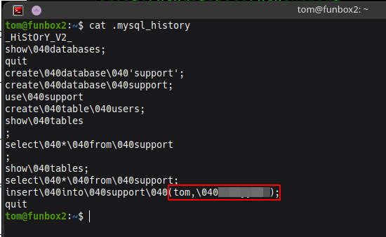

# FunboxRookie
Points - 5  
Difficulty - Easy
---

First we scan the given ip using    
```
$ nmap -A ip_address
```
nmap out put shows ftp open with **Anomymous** login allowed on *port 21* and SSH is also open on port 22


You can open the ftp server on your browser. Download the zip files    

    


When you try to unzip the files it's prompting for a *password*.   
To bypass this we can use **johntheripper**'s *zip2john* tool to convert them into .hash files and crack them using **johntheripper**.  

You can convert them into .hash files using the command 
```
$ zip2john filename.zip > filename.hash
```
To use **johntheripper** on the hash file use this command      
```
$ john --wordlist=/path/rockyou.txt filename.hash 
```

**johntheripper** could only crack tom.zip


Unzipping tom.zip we get tom's private login key for the SSH server.    

Change the private key to readable  
```
$ chmod 400 filename
```

Connect to Tom's SSH server with this key   
```
$ ssh -i id_rsa tom@ip_address
```

While trying to execute some of the commands in shell it was restricting me and was showing something as **rbash**


After some googling I found that rbash means restricted bash shell and started to search if there were any vulnerabilties or exploits.
I found [this](https://www.exploit-db.com/docs/english/44592-linux-restricted-shell-bypass-guide.pdf) on exploit-db

I used this to bypass the rbash
```
python3 -c 'import os; os.system("/bin/bash")'
```
Voila we bypassed the rbash     

While listing all the hidden folders I found *.mysql_history* I don't know if this is common or not but i never saw this, so I opened it.


Opening the *.mysql_history* file we find some interesting things.

     

The insert could've probably been for a users table and with a potential password.

Bingo! it is the password for Tom

Running ```$ sudo -l``` we find out that Tom can run any command with a password.   

To run as root use      
```
$ sudo su
```
After getting root privilges you can just find the flags in home directories of root and the user Tom


This is my first write-up pls don't be hard on it if you couldn't understand something.
