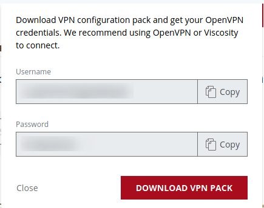
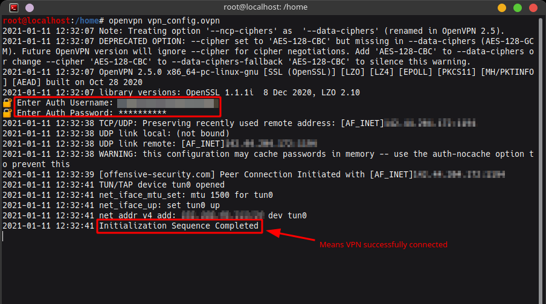

# Offsec-labs
---

## How to connect to Offsec labs
To start any of the machines you must first connect to the **VPN** first.   
You can find the **CONNECT TO VPN** button.     

You'll be prompted with this, save the *username* and *password* and download the VPN pack.



To start the openvpn connection enter ```$ openvpn your_filename_here.ovpn``` in the terminal in the same directory as your .ovpn file

Enter the previously saved *username* and *password* when prompted and connection will be initialized.  


